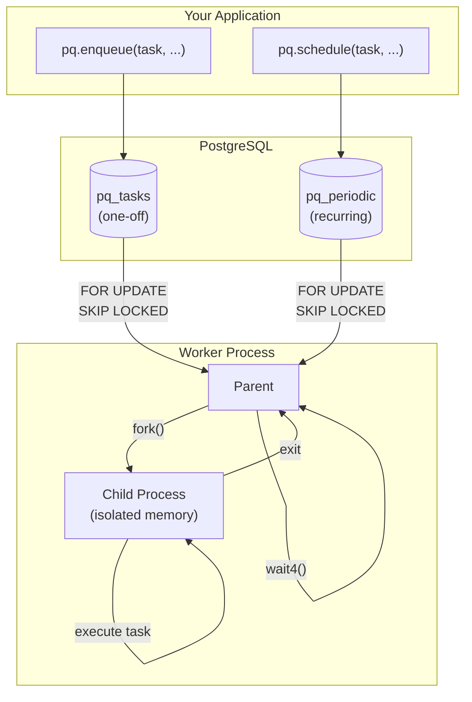
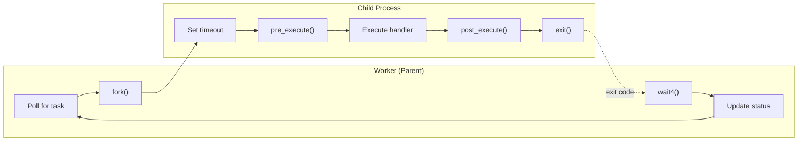
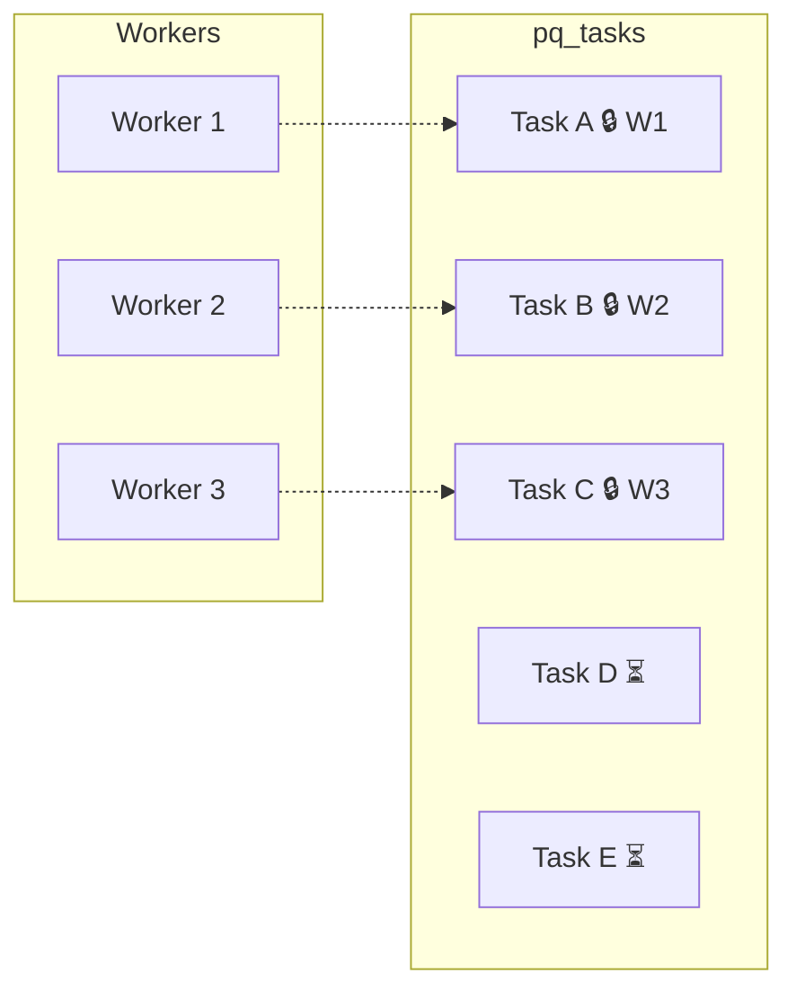
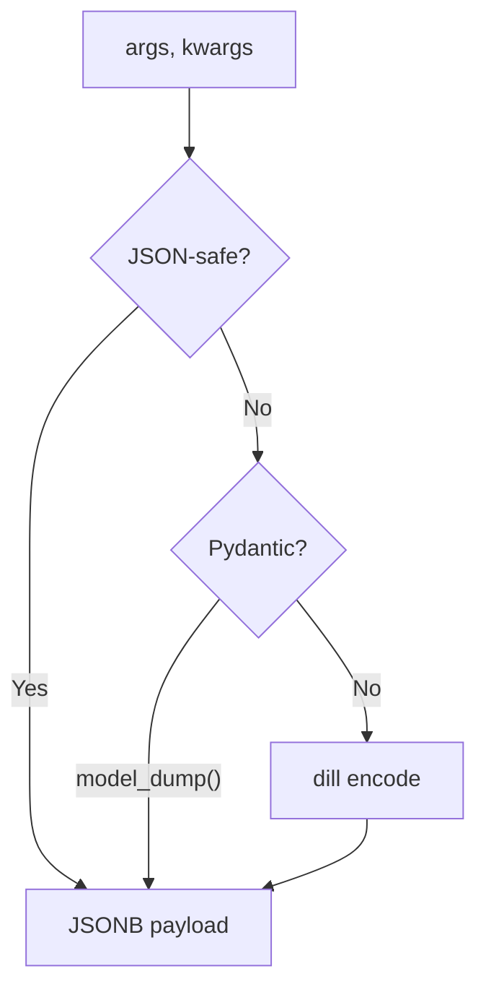
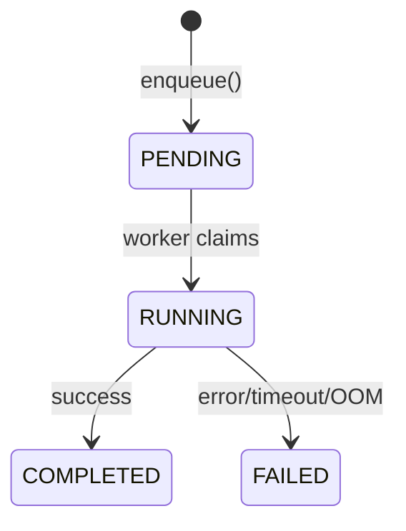

# Architecture

## Overview



## Components

### PQ Client

The main interface for your application:

```python
from pq import PQ

pq = PQ("postgresql://localhost/mydb")

# Enqueue one-off tasks
pq.enqueue(send_email, to="user@example.com")

# Schedule recurring tasks
pq.schedule(cleanup, run_every=timedelta(hours=1))
```

### PostgreSQL Tables

**`pq_tasks`** - One-off tasks:

| Column | Purpose |
|--------|---------|
| `name` | Function path (e.g., `myapp.tasks:send_email`) |
| `payload` | JSONB with serialized args/kwargs |
| `priority` | 0-100, higher runs first |
| `status` | pending → running → completed/failed |
| `run_at` | Scheduled execution time |
| `error` | Error message if failed |

**`pq_periodic`** - Recurring schedules:

| Column | Purpose |
|--------|---------|
| `name` | Function path (unique) |
| `payload` | JSONB with serialized args/kwargs |
| `priority` | 0-100, higher runs first |
| `run_every` | Interval (e.g., 1 hour) |
| `cron` | Cron expression (e.g., `0 9 * * 1`) |
| `next_run` | Next scheduled execution |

## Fork Isolation

Every task runs in an isolated child process:



The parent monitors the child via `wait4()` and detects:

| Exit Condition | Detection | Result |
|----------------|-----------|--------|
| Success | Exit code 0 | `COMPLETED` |
| Exception | Exit code 1 + pipe message | `FAILED` with error |
| Timeout | Exit code 124 or SIGALRM | `FAILED` with timeout |
| OOM | SIGKILL (signal 9) | `FAILED` with OOM |
| Crash | Other signals | `FAILED` with signal |

**Benefits:**

- **Memory isolation** - Child OOM doesn't crash worker
- **Crash isolation** - Segfaults only kill the child
- **Clean state** - Each task starts fresh
- **Hook safety** - Lifecycle hooks run in the child, safe for fork-unsafe resources

### Lifecycle Hooks

Optional `pre_execute` and `post_execute` hooks run in the forked child:

```python
from pq import Task, Periodic

def pre_execute(task: Task | Periodic) -> None:
    # Initialize fork-unsafe resources (OTel, DB connections)
    pass

def post_execute(task: Task | Periodic, error: Exception | None) -> None:
    # Cleanup/flush (OTel traces, etc.)
    pass

pq.run_worker(pre_execute=pre_execute, post_execute=post_execute)
```

This is essential for OpenTelemetry and similar libraries that don't survive `fork()`.

## Concurrency

Multiple workers safely process tasks in parallel using PostgreSQL's `FOR UPDATE SKIP LOCKED`:



```sql
SELECT * FROM pq_tasks
WHERE status = 'pending' AND run_at <= now()
ORDER BY priority DESC, run_at
FOR UPDATE SKIP LOCKED
LIMIT 1;
```

- `FOR UPDATE` locks the selected row
- `SKIP LOCKED` skips rows locked by other workers
- Each task runs exactly once

## Priority System

Tasks are processed in priority order (higher first):

| Priority | Value | Use Case |
|----------|-------|----------|
| `CRITICAL` | 100 | User-facing, time-sensitive |
| `HIGH` | 75 | Important but less urgent |
| `NORMAL` | 50 | Default |
| `LOW` | 25 | Background work |
| `BATCH` | 0 | Bulk operations |

Dedicated workers can handle specific priorities:

```python
# High-priority worker
pq.run_worker(priorities={Priority.CRITICAL, Priority.HIGH})

# Batch worker
pq.run_worker(priorities={Priority.BATCH})
```

## Serialization



| Type | Method |
|------|--------|
| str, int, list, dict, None | JSON |
| Pydantic models | `model_dump()` → JSON |
| Lambdas, closures, custom objects | dill (pickle-like) |

## Task Lifecycle



## File Structure

```
src/pq/
├── __init__.py      # Public API exports
├── client.py        # PQ class - main interface
├── worker.py        # Worker loop and fork execution
├── models.py        # SQLAlchemy models (Task, Periodic)
├── priority.py      # Priority enum
├── serialization.py # JSON/Pydantic/dill serialization
├── registry.py      # Function path resolution
└── logging.py       # Loguru configuration
```
